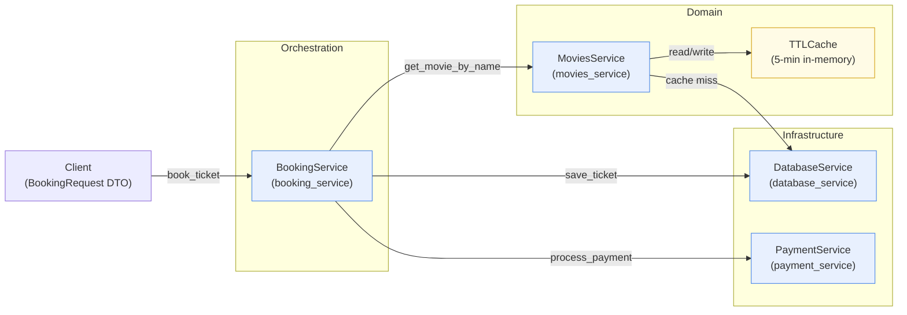
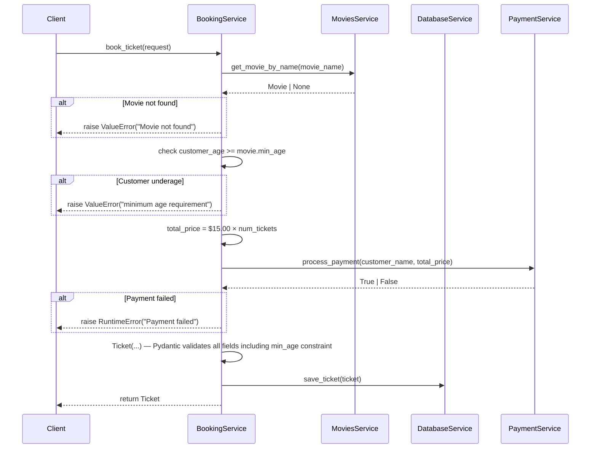
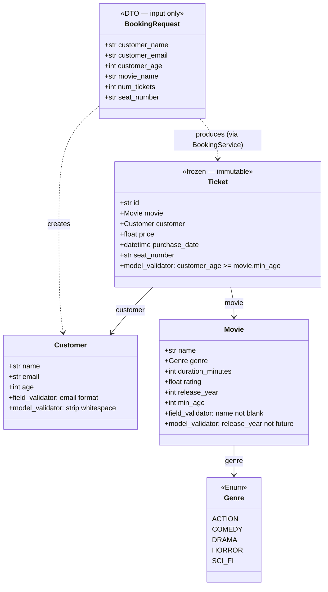

# Ticketing System Architecture

Visual reference for the cinema ticket booking demo used throughout the Python bootcamp.

---

## 1. Service Architecture

How the service layer is structured and how dependencies flow at runtime vs. in tests.

> **Singleton pattern**: Each service class is underscore-prefixed (`_BookingService`) with a public
> module-level instance (`booking_service`). Never instantiate directly.
>
> **Setter DI for tests**: `booking_service.set_movies(mock)`, `.set_db(mock)`, `.set_payment(mock)`
> allow injecting test doubles. Reset with `unstub()` in `tearDown`.

---

## 2. Booking Flow

Step-by-step sequence of `BookingService.book_ticket()`, including all error paths.

> **Note on MoviesService cache**: On a cache hit, `MoviesService` returns the movie directly
> without calling `DatabaseService`. On a cache miss it fetches from DB and caches the result
> for 5 minutes (TTLCache).

---

## 3. Model Relationships

Pydantic models used across the system and how they compose.

